# Etapa 4 - Análisis Exploratorio de Datos

## 1. Objetivo

Describir las distribuciones del dataset ficticio procesado, con 2500 filas y 10 columnas, y cerrar con el único cruce autorizado: espera por cobertura. Se leyeron los informes de las Etapas 1–3. No se realizan inferencias poblacionales, pruebas estadísticas, correlaciones, explicaciones causales, clasificación de vulnerabilidad, dashboard ni modelado.

**Método:** cada cálculo usa casos disponibles de las variables necesarias. Los porcentajes se calculan sobre el N efectivo de la variable, no sobre 2500 cuando hay NA. Los NA se excluyen solo del cálculo y se conservan en el dataset. Desviación estándar muestral (ddof=1), cuartiles con interpolación lineal; resultados redondeados a dos decimales. Las barras parten de cero. Los intervalos de histogramas son recursos gráficos y no generan grupos ni columnas.

Reproducción: notebooks/04_eda.ipynb. Python 3.12.3, pandas 3.0.5, NumPy 2.5.3, matplotlib 3.11.2.

## 2. Composición del dataset

### Cobertura de salud

| Categoría     | Frecuencia | Porcentaje disponible | N efectivo |
| ------------- | ---------: | --------------------: | ---------: |
| Privada       |        843 |                33.72% |       2500 |
| Pública       |        806 |                32.24% |       2500 |
| Sin cobertura |        851 |                34.04% |       2500 |

**Pregunta:** ¿Cómo se distribuyen los registros por cobertura de salud?

**Visualización:** Barras. Permite comparar proporciones entre categorías nominales mediante longitudes desde una base común, sin imponerles un orden de magnitud.

**Observación descriptiva:** Sin cobertura: 851 registros (34.04%); Pública: 806 (32.24%). N=2500. Las diferencias describen composición, no desigualdades demostradas.

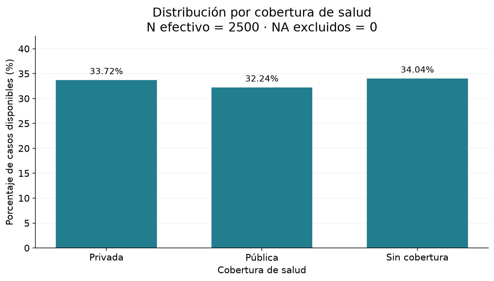

### Región

| Categoría    | Frecuencia | Porcentaje disponible | N efectivo |
| ------------ | ---------: | --------------------: | ---------: |
| Norte        |        484 |                19.36% |       2500 |
| Centro       |        495 |                19.80% |       2500 |
| Sur          |        505 |                20.20% |       2500 |
| CABA         |        498 |                19.92% |       2500 |
| Buenos Aires |        518 |                20.72% |       2500 |

**Pregunta:** ¿Cómo se distribuyen los registros por región?

**Visualización:** Barras. Permite comparar proporciones entre categorías nominales mediante longitudes desde una base común, sin imponerles un orden de magnitud.

**Observación descriptiva:** Buenos Aires: 518 registros (20.72%); Norte: 484 (19.36%). N=2500. Las diferencias describen composición, no desigualdades demostradas.

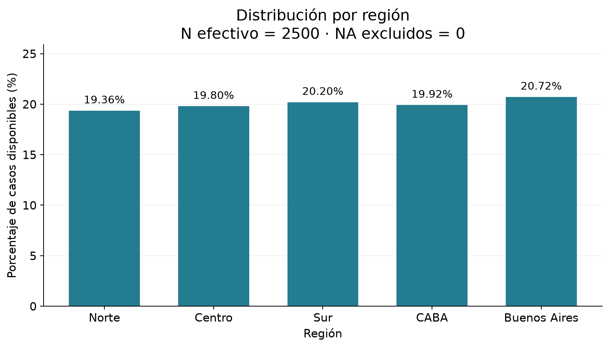

### Condición de salud

| Categoría | Frecuencia | Porcentaje disponible | N efectivo |
| --------- | ---------: | --------------------: | ---------: |
| Saludable |        828 |                33.12% |       2500 |
| Crónica   |        843 |                33.72% |       2500 |
| Aguda     |        829 |                33.16% |       2500 |

**Pregunta:** ¿Cómo se distribuyen los registros por condición de salud?

**Visualización:** Barras. Permite comparar proporciones entre categorías nominales mediante longitudes desde una base común, sin imponerles un orden de magnitud.

**Observación descriptiva:** Crónica: 843 registros (33.72%); Saludable: 828 (33.12%). N=2500. Las diferencias describen composición, no desigualdades demostradas.

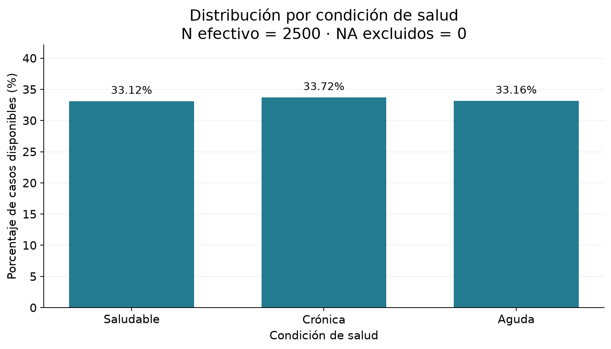

### Género

| Categoría | Frecuencia | Porcentaje disponible | N efectivo |
| --------- | ---------: | --------------------: | ---------: |
| F         |        840 |                33.60% |       2500 |
| M         |        833 |                33.32% |       2500 |
| Otro      |        827 |                33.08% |       2500 |

**Pregunta:** ¿Cómo se distribuyen los registros por género?

**Visualización:** Barras. Permite comparar proporciones entre categorías nominales mediante longitudes desde una base común, sin imponerles un orden de magnitud.

**Observación descriptiva:** F: 840 registros (33.60%); Otro: 827 (33.08%). N=2500. Las diferencias describen composición, no desigualdades demostradas.

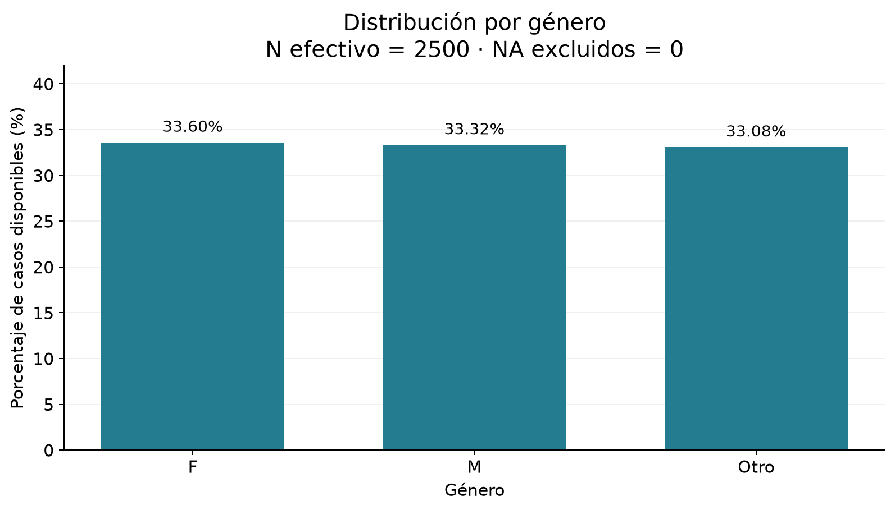

## 3. Perfil etario

| Medida              | Valor |
| ------------------- | ----: |
| N efectivo          |  2500 |
| NA excluidos        |     0 |
| Media               | 45.40 |
| Mediana             | 45.00 |
| Desviación estándar | 26.49 |
| Mínimo              |  0.00 |
| Q1                  | 22.00 |
| Q3                  | 69.00 |
| Máximo              | 90.00 |

**Pregunta:** ¿Cómo se distribuyen las edades registradas?

**Visualización:** Histograma. Agrupa solo para representar la distribución cuantitativa en intervalos de igual amplitud; permite observar concentraciones y extensión sin crear grupos etarios.

**Observación descriptiva:** Las edades van de 0 a 90; media 45.40 y mediana 45. El 50% central queda entre 22 y 69.

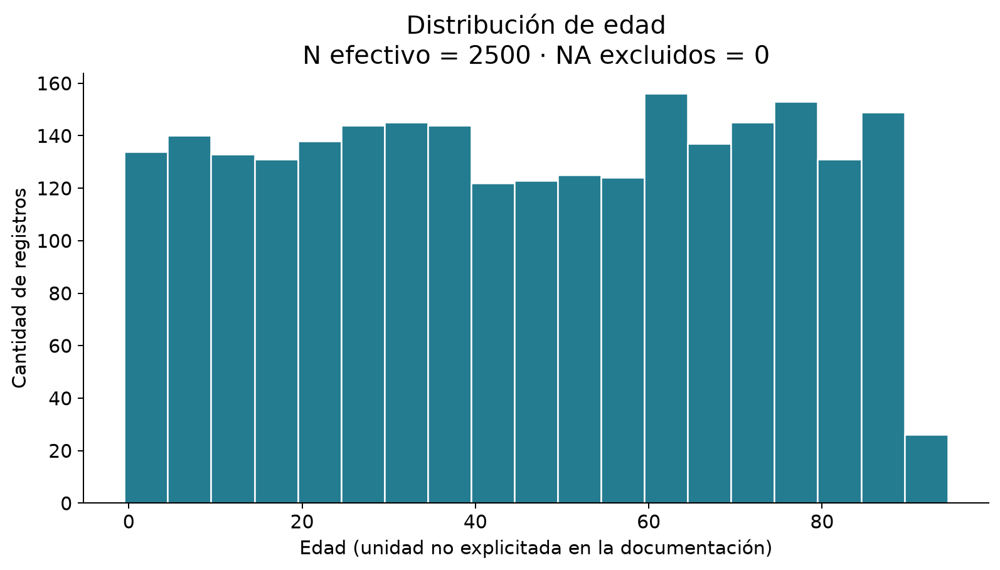

No se agrega boxplot de edad: los cuartiles están en la tabla y el histograma muestra la extensión y las frecuencias; una segunda figura aportaría principalmente un resumen ya disponible. No se crearon grupos etarios.

## 4. Frecuencia de atención

| Medida              | Valor |
| ------------------- | ----: |
| N efectivo          |  2500 |
| NA excluidos        |     0 |
| Media               |  6.19 |
| Mediana             |  4.00 |
| Desviación estándar |  5.58 |
| Mínimo              |  0.00 |
| Q1                  |  2.00 |
| Q3                  | 10.00 |
| Máximo              | 20.00 |

**Pregunta:** ¿Cuántas consultas anuales registran los pacientes?

**Visualización:** Barras por valor entero. La variable es un conteo discreto: una barra por cantidad conserva cada valor y evita mezclar consultas diferentes en intervalos.

**Observación descriptiva:** Media 6.19, mediana 4; el valor más frecuente es 3 consultas (388 registros; 15.52%). El rango es 0–20.

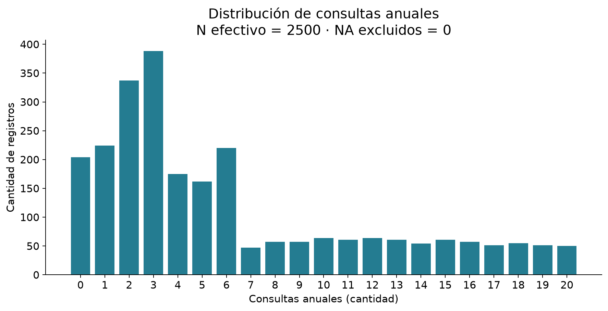

## 5. Tiempo de espera

| Medida              | Valor  |
| ------------------- | -----: |
| N efectivo          |   2426 |
| NA excluidos        |     74 |
| Media               |  64.58 |
| Mediana             |  54.00 |
| Desviación estándar |  47.71 |
| Mínimo              |   5.00 |
| Q1                  |  23.00 |
| Q3                  |  99.00 |
| Máximo              | 180.00 |

**Pregunta:** ¿Cómo se distribuyen los tiempos de espera disponibles?

**Visualización:** Histograma. Muestra la forma y extensión de una duración cuantitativa; las referencias de media y mediana permiten compararlas sobre la misma escala.

**Observación descriptiva:** Media 64.58 min y mediana 54 min (diferencia 10.58 min); rango 5–180 min. Hay mayor extensión por encima de la mediana, compatible con asimetría hacia valores altos; no se atribuyen causas.

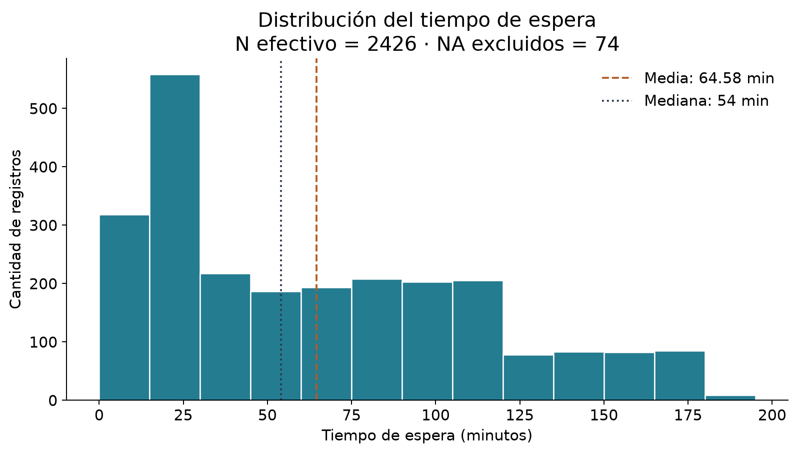

**Pregunta:** ¿Dónde se ubican la mediana y el 50% central de las esperas?

**Visualización:** Boxplot horizontal. Complementa las frecuencias del histograma mostrando directamente el intervalo central y su dispersión; los bigotes no constituyen límites de validez.

**Observación descriptiva:** Q1=23, mediana=54 y Q3=99 min: IQR=76 min. No se recortaron ni modificaron extremos.

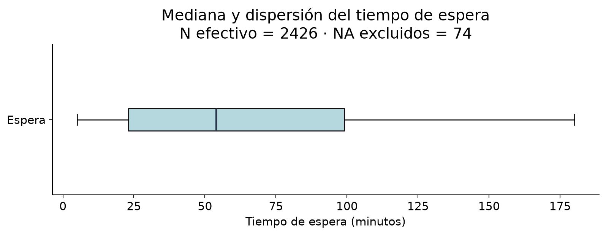

## 6. Acceso a medicación

| Categoría | Frecuencia | Porcentaje disponible | N efectivo |
| --------- | ---------: | --------------------: | ---------: |
| Sí        |       1695 |                67.80% |       2500 |
| No        |        805 |                32.20% |       2500 |

**Pregunta:** ¿Qué proporción registra acceso a medicación?

**Visualización:** Barras. Compara las proporciones de dos categorías nominales con una base común y etiquetas directas.

**Observación descriptiva:** Sí: 1695 (67.80%); No: 805 (32.20%). N=2500.

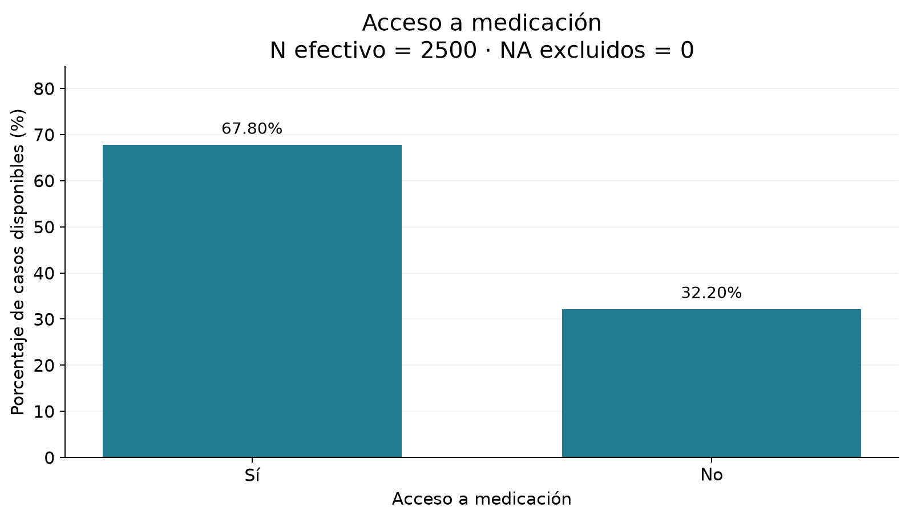

## 7. Satisfacción

| Categoría | Frecuencia | Porcentaje disponible | N efectivo |
| --------- | ---------: | --------------------: | ---------: |
| 1         |        139 |                 5.72% |       2428 |
| 2         |        328 |                13.51% |       2428 |
| 3         |        576 |                23.72% |       2428 |
| 4         |        794 |                32.70% |       2428 |
| 5         |        591 |                24.34% |       2428 |

N efectivo: **2428**; NA excluidos del cálculo: **72**. Mediana: **4**; moda: **4**. Es una escala ordinal: se describe por niveles ordenados, mediana y moda. No se calcula la media en esta etapa; su eventual uso como KPI requiere justificar la interpretación de distancias entre niveles.

**Pregunta:** ¿Cómo se distribuyen los cinco niveles de satisfacción?

**Visualización:** Barras ordenadas 1–5. Conserva el orden ordinal de los niveles y mantiene categorías separadas, sin representar la escala como una variable continua.

**Observación descriptiva:** El nivel 4 es el más frecuente: 794 registros (32.70% de 2428 respuestas disponibles); mediana y moda son 4.

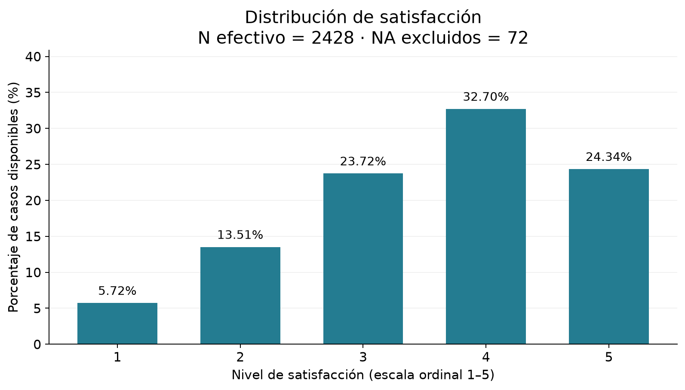

## 8. Tiempo de espera por cobertura

| Cobertura     | N total | N con espera | NA de espera | Media (min) | Mediana (min) |
| ------------- | ------: | -----------: | -----------: | ----------: | ------------: |
| Privada       |     843 |          823 |           20 |       17.60 |         18.00 |
| Pública       |     806 |          777 |           29 |       70.19 |         71.00 |
| Sin cobertura |     851 |          826 |           25 |      106.11 |        105.00 |

**Pregunta:** ¿Cuál es el tiempo promedio observado por cobertura?

**Visualización:** Barras de medias. Compara una misma medida resumen de duración entre categorías nominales. Cada barra usa solo tiempos presentes y muestra su N; no representa la distribución interna de cada categoría.

**Observación descriptiva:** Privada: 17.60 min (N=823, NA=20); Pública: 70.19 min (N=777, NA=29); Sin cobertura: 106.11 min (N=826, NA=25). Son promedios observados en este dataset ficticio, sin pruebas de significación ni interpretación causal.

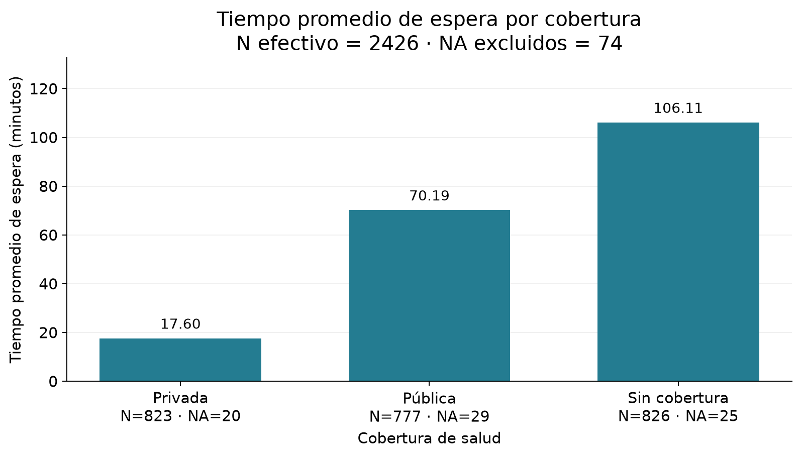

Este es el único cruce realizado y corresponde al Nivel 1 del caso. No se agregan pruebas, correlaciones ni ajustes por otras variables.

## 9. Catálogo y justificación de visualizaciones

| Pregunta analítica                                           | Variable(s)                        | Indicador                              | Visualización elegida   | Justificación                                                                                                                                                                           | N efectivo                                     | Archivo de figura                                                                                   |
| ------------------------------------------------------------ | ---------------------------------- | -------------------------------------- | ----------------------- | --------------------------------------------------------------------------------------------------------------------------------------------------------------------------------------- | ---------------------------------------------- | --------------------------------------------------------------------------------------------------- |
| ¿Cómo se distribuyen los registros por cobertura de salud?   | Cobertura_Salud                    | Frecuencia y porcentaje                | Barras                  | Permite comparar proporciones entre categorías nominales mediante longitudes desde una base común, sin imponerles un orden de magnitud.                                                 | 2500                                           | [cobertura_distribucion.png](../outputs/figuras/eda/cobertura_distribucion.png)                     |
| ¿Cómo se distribuyen los registros por región?               | Region                             | Frecuencia y porcentaje                | Barras                  | Permite comparar proporciones entre categorías nominales mediante longitudes desde una base común, sin imponerles un orden de magnitud.                                                 | 2500                                           | [region_distribucion.png](../outputs/figuras/eda/region_distribucion.png)                           |
| ¿Cómo se distribuyen los registros por condición de salud?   | Condicion_Salud                    | Frecuencia y porcentaje                | Barras                  | Permite comparar proporciones entre categorías nominales mediante longitudes desde una base común, sin imponerles un orden de magnitud.                                                 | 2500                                           | [condicion_salud_distribucion.png](../outputs/figuras/eda/condicion_salud_distribucion.png)         |
| ¿Cómo se distribuyen los registros por género?               | Genero                             | Frecuencia y porcentaje                | Barras                  | Permite comparar proporciones entre categorías nominales mediante longitudes desde una base común, sin imponerles un orden de magnitud.                                                 | 2500                                           | [genero_distribucion.png](../outputs/figuras/eda/genero_distribucion.png)                           |
| ¿Cómo se distribuyen las edades registradas?                 | Edad                               | Frecuencia por intervalo de 5 unidades | Histograma              | Agrupa solo para representar la distribución cuantitativa en intervalos de igual amplitud; permite observar concentraciones y extensión sin crear grupos etarios.                       | 2500                                           | [edad_distribucion.png](../outputs/figuras/eda/edad_distribucion.png)                               |
| ¿Cuántas consultas anuales registran los pacientes?          | Frecuencia_Atencion                | Frecuencia de cada conteo entero       | Barras por valor entero | La variable es un conteo discreto: una barra por cantidad conserva cada valor y evita mezclar consultas diferentes en intervalos.                                                       | 2500                                           | [frecuencia_atencion_distribucion.png](../outputs/figuras/eda/frecuencia_atencion_distribucion.png) |
| ¿Cómo se distribuyen los tiempos de espera disponibles?      | Tiempo_Espera_min                  | Frecuencia por intervalo de 15 minutos | Histograma              | Muestra la forma y extensión de una duración cuantitativa; las referencias de media y mediana permiten compararlas sobre la misma escala.                                               | 2426                                           | [tiempo_espera_distribucion.png](../outputs/figuras/eda/tiempo_espera_distribucion.png)             |
| ¿Dónde se ubican la mediana y el 50% central de las esperas? | Tiempo_Espera_min                  | Mediana, cuartiles y bigotes 1.5 × IQR | Boxplot horizontal      | Complementa las frecuencias del histograma mostrando directamente el intervalo central y su dispersión; los bigotes no constituyen límites de validez.                                  | 2426                                           | [tiempo_espera_boxplot.png](../outputs/figuras/eda/tiempo_espera_boxplot.png)                       |
| ¿Qué proporción registra acceso a medicación?                | Acceso_Medicacion                  | Frecuencia y porcentaje                | Barras                  | Compara las proporciones de dos categorías nominales con una base común y etiquetas directas.                                                                                           | 2500                                           | [acceso_medicacion_distribucion.png](../outputs/figuras/eda/acceso_medicacion_distribucion.png)     |
| ¿Cómo se distribuyen los cinco niveles de satisfacción?      | Satisfaccion                       | Frecuencia y porcentaje por nivel      | Barras ordenadas 1–5    | Conserva el orden ordinal de los niveles y mantiene categorías separadas, sin representar la escala como una variable continua.                                                         | 2428                                           | [satisfaccion_distribucion.png](../outputs/figuras/eda/satisfaccion_distribucion.png)               |
| ¿Cuál es el tiempo promedio observado por cobertura?         | Cobertura_Salud; Tiempo_Espera_min | Media de espera por cobertura          | Barras de medias        | Compara una misma medida resumen de duración entre categorías nominales. Cada barra usa solo tiempos presentes y muestra su N; no representa la distribución interna de cada categoría. | Privada: 823; Pública: 777; Sin cobertura: 826 | [espera_promedio_cobertura.png](../outputs/figuras/eda/espera_promedio_cobertura.png)               |

## 10. Hallazgos descriptivos

Los siguientes resultados se limitan a este dataset ficticio; no son explicaciones ni recomendaciones.

- Las coberturas tienen entre 32.24% y 34.04% de los registros (N=2500).
- Edad: media 45.40, mediana 45, Q1=22 y Q3=69, con rango 0–90 (N=2500; unidad no explicitada por el documento).
- Consultas anuales: media 6.19 y mediana 4; 3 consultas es el conteo más frecuente, con 388 registros (15.52%; N=2500).
- Espera: media 64.58 y mediana 54 minutos; el 50% central está entre 23 y 99 minutos (N=2426; 74 NA excluidos solo del cálculo).
- Acceso a medicación: 1695 registros con Sí (67.80%) y 805 con No (32.20%), sobre N=2500.
- Satisfacción: nivel 4 en 794 registros (32.70%), con mediana y moda 4 (N=2428; 72 NA excluidos solo del cálculo).
- Espera por cobertura: Privada: 17.60 min (N=823, NA=20); Pública: 70.19 min (N=777, NA=29); Sin cobertura: 106.11 min (N=826, NA=25). Son promedios observados en este dataset ficticio, sin pruebas de significación ni interpretación causal.

## 11. Limitaciones y preguntas para la siguiente etapa

Los datos son ficticios y contienen relaciones incorporadas según el caso: no representan evidencia poblacional. Las diferencias descriptivas no prueban desigualdades ni causas. Se desconoce el mecanismo de los faltantes; los resúmenes de espera y satisfacción describen solo sus casos disponibles. La unidad de edad, el período de referencia de espera y el significado operativo de acceso a medicación no están completamente documentados. Satisfacción es ordinal y no se asumen distancias iguales entre sus niveles.

Preguntas para una etapa posterior, sin responder aquí: ¿cómo se relacionan espera y satisfacción? ¿Cómo varía el acceso a medicación por cobertura y condición de salud? ¿Cómo cambia la frecuencia de atención según la condición? Estas preguntas proceden de los objetivos previos; no se incorporan nuevos cruces en esta etapa.

**Control final:** once figuras con datos y archivos existentes; porcentajes sobre casos disponibles suman 100% antes del redondeo; N y NA reconciliados por variable y cobertura; satisfacción ordenada 1–5; no se trataron NA como cero. Se verificó igualdad exacta del DataFrame y hashes SHA-256 de los siete archivos protegidos. No hubo imputaciones, eliminación de filas, nuevas columnas ni modificación de archivos previos.

SHA-256 del procesado conservado: 6707074a0d805b2fce33f461c10c9335adcb5ab302d960bc0e963db868b983bd.
